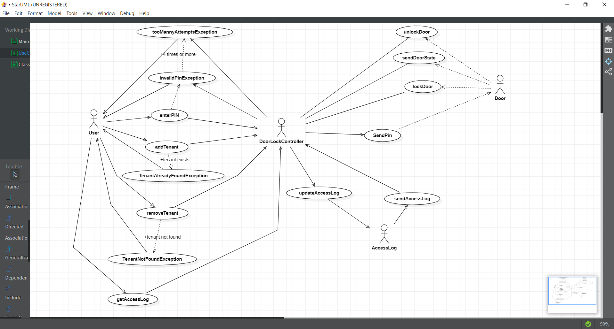
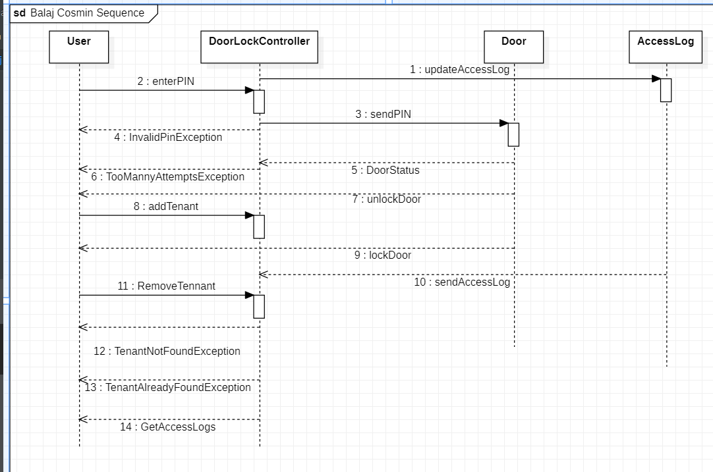

# Safe Home Access

##  - Java implementation

Note:the UI is made using IntelliJ IDEA. It might not work on other IDEs

This progtam is a safe home access Java application based on the diagram above. 

Functional requirements:

1. If pin is wrong _enterPin_ method throws an _InvalidPinException_.
2. If 3 consecutive attempts are made to enter pin then the door is locked(until master key pin is used) and _enterPin_ method throws TooManyAttemptsException. Any further invocations of _enterPin_ method will throw TooManyAttemptsException.
3. If master key pin is used, door will be unlocked and retries count will be reset to 0.
4. If pin is correct, door shall be opened or closed depending on current state (if open will be closed, if closed will be opened)
5. When tenant already exists by name, _addTenant_ method will throw TenantAlreadyExistsException.
6. When tenant not found, _removeTenant_ method will throw TenantNotFoundException.
7. All attempts (successful or not) will be logged in access log list.

## Use case diagram

## Sequence diagram

